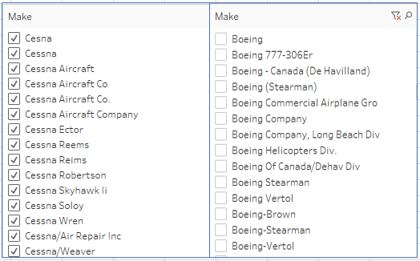
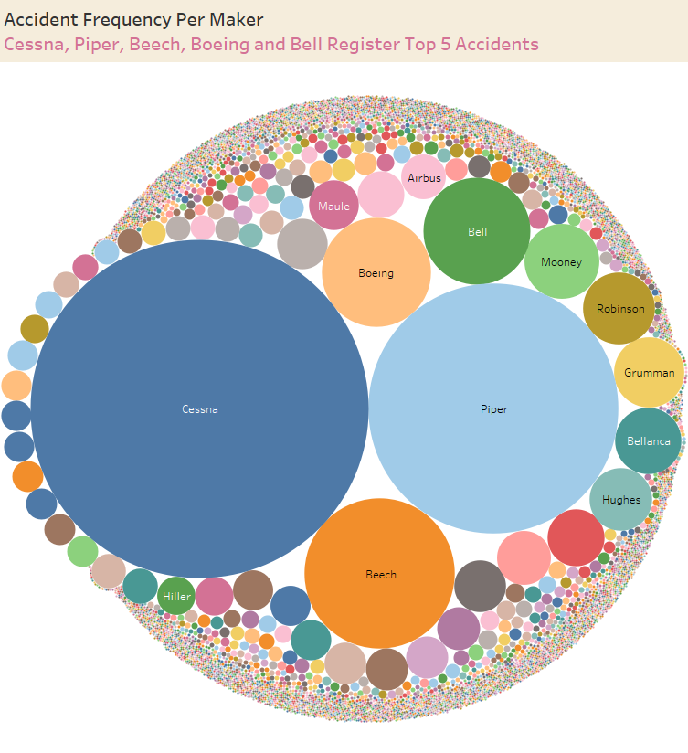

# **Problem Definition**

Our company's expansion and diversification plans include venturing into the aviation industry to own and operate airplanes for commercial and private enterprises. A key preliminary step for this consideration is risk assesment for different aircrafts to advise which aircrafts pose the lowest risk for the intended business endeavor. This projects seeks to assess risk potential from analysis of aviation accident data from 1962 to 2023. 

The primary objective of this exercise is to identify the lowest-risk aircraft for our company to purchase and operate. The following are some of the key considerations we expect to make:

*   Historical accident trends by aircraft type
*   Severity and frequency of accidents
*   Factors contributing to the accidents e.g. weather, pilot error or mechanical failures
*   Any correlations between operational risk and aircraft characteristics

# **Data Preprocessing**

This section prepare the provided aviation data for analysis. We intend to do the following:

*   Dataset Overview - Load and understand the data
*   Handling Missing Values using derived domain knowledge and imputation
*   Data Cleaning e.g. standardizing categorical values, deriving useful date data, removing duplicates etc

## **Dataset Overview**

It is imperative for us to understand the aviation dataset first i.e.:

*   The data structure e.g. available columns, data types and presence of missing values
*   Establish the relevance of the data to our study
*   Identify useful columns to focus on

Data Understanding will prescribe subsequent cleaning steps to be done in the **Data Cleaning** subsection

First, we initialize common libraries we project to utilize in this exercise:

*   pandas to create and manipulate dataframes
*   seaborn to facilitate any requisite visualizations within the notebook
*   numpy for mathematical calculations
*   etc

We then load the dataset and embark on a data understanding exercise.

### Data Understanding

Sampling a few columns to assess the various categorical data present will help us define how to clean the data, e.g.:

*   **Investigation.Type**: There are 71 different categories, but the only seemingly relevant categories here are 'Accident' and 'Incident'. The others seem like noise. Perusal of the 'noisy" data on excel showed that where the column "Event.Id" was blank, there was a noisy column in 'Investigation.Type'. Dropping rows with empty Event.ID may fix this
*   **Injury.Severity**: Where there are fatalities, the number of fatalies is appended on the string. This is unnecessary, since there's another column that details the number of fatalities. There is a need to clean this column to only have **Fatal**, **Serious**, **Minor**, **Non-Fatal**, **Incident** and **Unavailable**. There is missing data.
*   **Aircraft.damage**: The categorization of extent of damage seems okay as is i.e. 4 categories (**Destroyed**, **Substantial**, **Minor**, **Unknown**). There is no need for cleaning this column. There is missing data.
*   **Aircraft.Category**: The categorization of Aircrafts seems okay as is. But there is a need to combine '**Unknown**' and '**UNK**' such that they are the same category. There is missing data.
*   **Make**: Unstandardized capitalization is causing the same manufacturer to be split e.g. Cessna vs CESSNA. There is a need to regularize capitalization to prevent such an error. Also, there is noise intoduced by having entries such as 'Cessna Aircraft' vs 'Cessna Aircraft Co' vs 'Cessna Aircraft Co.'. As they are too many possibilities, we may need to ignore this for now (and revisit once we can make use of fuzzy logic to normalize similar/equivalent data). There is missing data.

*   **Model**: A bit of non-standardized capitalization introduces noise into the data. This will need to be corrected. There is missing data.
*   **Amateur.Built**: There are 2 categories: **Yes** and **No** as well ass missing data.
*   **Engine.Type**: The column seems clean, with Reciprocating Engine Aircrafts accounting for majority of the accidents/incidents. Entries with "UNK" should be substituted with "Unknown" to clean the data. There are missing values.
*   **Purpose.of.flight**: The column seems clean, with personal flights accounting for majority of the accidents/incidents.
*   **Weather.Condition**: IMC, or **Instrument Meteorological Conditions**, are weather conditions that require a pilot to rely on flight instruments. On the other hand, VMC, or **Visual Meteorological Conditions**, are weather conditions that allow a pilot to navigate by visual reference to the ground and other landmarks. 91.6% of the accidents occured during VMC i.e. weather is hardly a factor leading to accidents. We need to combine 'UNK' with 'Unk' i.e. standardize capitalization.
*   **Broad.phase.of.flight**: Majority of the accidents occur during landing e.g. 24.995%.
*   **Schedule**: There seems to be a rather even distribution between scheduled and non-scheduled flights where accidents/incidents occurred, although more accidents occur for non-scheduled flights (35% vs 31%). We will need to replace "UNK" with "Unknown" to maintain similar format.

Summarily, the dataset contains 31 columns and 90348 rows (including the header columns). There are several missing values in different columns. The only column without any missing data is the 'Investigation.Type' column, and this can form a good place to start with the data cleaning exercise.

Further perusal of the data in Microsoft Excel gave some preliminary insights that can advise the data cleaning exercise:

*   Where 'Event.Id' is blank, all the other columns are also blank. These could be deleted from the onset
*   'Event.Date' uses a YYYY-MM-DD format whereas 'Publication.Date' uses a DD-MM-YYYY format. It would be better to standardize the date formats
*   'Investigation.Type' seems to have 2 relevant values, i.e. "Accident" and "Incident". The rest of the values seem to be dates, and where it is a date, the rest of the columns are empty. Such rows can also be deleted from the onset.
*   In the column 'Injury.Severity', there are too many categories since the number of fatalities is appended beside the label 'Fatal'. This is repetitive since there is another independent column 'Total.Fatal.Injuries' that details the number of fatalities. It may be better to just define the category 'fatal' for this column.
*   In the column 'Make', capitalization differences have been noted e.g. 'CESSNA' vs 'Cessna'. This could make python consider these as two different makers. This needs to be standardized/corrected.

### Data Cleaning

### Exploratory Data Analysis

Cessna, Piper, Beech, Boeing and Bell registered the most accidents.

In the event of an accident, it is almost guaranteed that the aircraft damage will be substantial to totally damaged for most of the makers.

